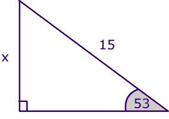

<!--
    ioslides_presentation: 
    keep_md: no
    logo: ~/KaplanFiles/Explore/checkr/inst/RStudioConf2018/mosaic-square.png
    self_contained: no
    smart: no
    widescreen: no
    df_print: kable
    theme: yeti

-->

```{r setup, include=FALSE}
library(learnr)
library(checkr)
knitr::opts_chunk$set(echo = FALSE)
tutorial_options(exercise.checker = checkr::check_for_learnr)


hello_check <- function(USER_CODE) {
  code <- for_checkr(USER_CODE)
  res <- misconception(code, line_where(code, insist(is.null(F))), 
                       message = paste(
                         "Just typing the string doesn't do it. Note that the output", 
                         "has quotes and is formatted as an output, not a simple message."))
  res <- misconception(res, line_where(res, insist(F == print)), 
                       message = paste(
                         "Using print() isn't right.",
                         "True, that's the way character strings are displayed,", 
                         "but the format of the display is as a quoted output and",
                         "not just a simple message."))
  res <- line_calling(res, cat, message, message = "Try the cat() or message() functions.")
  check(arg_number(res, 1), passif(V == "Hello, World!", "Good job!"),
        failif(tolower(V) == "hello, world!", "Get the capitalization right!"),
        failif(TRUE, "The string should be 'Hello, World!', not '{{V}}'.")) 
}

two_plus_two_check <- function(USER_CODE) {
  res <- for_checkr(USER_CODE)
  res <- line_where(res, insist(V == 4, "The result should be 4, not {{V}}."))
  res <- line_where(res, 
                    insist(F == `+`, paste(
                      "Think about what function corresponds to 'addition'.", 
                      "It isn't {{F}}.")))
  arg_number(res, 1, failif(V != 2, "The first argument should be 2, not {{E}}."),
             passif(TRUE, "Yes, that's it!"))
}

hello_fun_strict <- function(USER_CODE) {
  code <- for_checkr(USER_CODE)
  line_binding(code, 
               cat("Hello, World!"),  # a pattern with no flexibility.
               passif(TRUE, "That's right."),
               fail = "No. Try aain.")
}
```

## Scaffolding, hints, and solutions 

   

> Write an R statement to compute the numerical value of x.

```{r trig-1, exercise = TRUE}
..trig_function..( ..angle.. )
```

```{r trig-1-solution}
15 * sin(53 * pi / 180)
```

```{r trig-1-hint-1}
Is x a vertical or horizontal difference? Pick the appropriate trig function.
```

```{r trig-1-hint-2}
Sine is for vertical, cosine for horizontal.
```

```{r trig-1-hint-3}
The angle should be in radians.
```

### The four questions of passing

- What's to keep students from paging through the hints? Are there consequences?
    - Nothing, unless you log each event.
- What's there to ensure that the final answer is correct?
    - Nothing, unless you log that event and check it later.
- What's in the hint for **me**?
    - A student who already knows the `sin` part of the answer still has to walk through that hint.
- What happens to the student who doesn't even know what to ask, and just presses "Run."

## Once more, with ~~feeling~~ feedback.

   

```{r trig-2, exercise = TRUE}

```

```{r trig-2-check}
# USER_CODE <- quote("15 * sin(53*pi/180) + 2")
# USER_CODE <- quote("sin(53*pi/180)")
trig_2_check <- function(USER_CODE) {
  code <- for_checkr(USER_CODE)
  t1 <- if_empty_submission(code, message = "OK. Let's get you started. Pick a trig function such as sin(), cos(), tan(), giving the angle as an argument. Perhaps something like tan(40). This won't be right, but it will get you on track. ")
  t1 <- line_calling(t1, sin, cos, tan, message = "You should be using a trigonometric function.")
  t1 <- line_calling(t1, sin, message = "Make sure to pick the right trig function. cos() does horizontal lengths, sin() does vertical lengths.")
  if (failed(t1)) return(t1)
  a1 <- trig_radian_check(t1, 53*pi/180)
  if (failed(a1)) return(a1)
  t2 <- line_where(code, insist(F == `*`, "Remember to multiply by the length of the hypotenuse."))
  t3 <- arg_calling(t2, `*`)

  a1 <- arg_number(t3, 1, insist(V == 15, "How long is the hypothenuse? It says right on the diagram."))
  a2 <- arg_number(t3, 2, insist(V == 15, "How long is the hypothenuse? It says right on the diagram."))
  if (failed(a1 %or% a2)) return(a2)
  line_where(t2, insist(is.numeric(V)), 
             insist(abs(V - 11.98) < 0.01, "{{V}} is a wrong numerical result. It should be about 11.98."), 
             passif(TRUE, "Good!"))
}
trig_2_check(USER_CODE)
```

## Hello, World!

```{r hi-world, exercise = TRUE}
"Hello, World!"
```

```{r hi-world-check}
#USER_CODE <- "\"Hi world\""
code <- for_checkr(USER_CODE)
line_where(code, passif(TRUE, "Nice!"))
```


## Once more, with ~~feeling~~ feedback.

> Write the one-line version of "Hello, World!" in R. Your code should cause the message `Hello, World!` to appear. 


```{r eval = FALSE, echo = FALSE}
hello_check(quote("\"Hello, World!\""))
hello_check(quote(cat("Hello, World!")))
hello_check(quote(print("Hello, World")))
hello_check(quote(cat("hello")))
hello_check(quote(cat("Hello, world!")))
```

```{r hello-world-check}
hello_check(USER_CODE)
```

```{r hello-world, exercise = TRUE}
"Hello, World!"
```

## The man behind the curtain

Ordinarily, you would not show students the `checkr` statements implementing this behavior. But our purpose here is to introduce `checkr`, So here are the statements for the above exercise.

```{r echo = FALSE, comment = "", tidy = FALSE}
print_function_contents(
  hello_check,
  from_file = system.file("learnr_examples/internal-examples.R", 
                          package = "checkr"))
```

Breaking this down, line by line:

- [1] accepts the user submission from `learnr`. This is always called `USER_CODE`. The function `for_check()` does some pre-processing of the user submission to turn it into evaluated code and format it for use in later `checkr` functions.
- [2] tests for a particular kind of mistaken answer. The `misconception()` function will generate a `checkr` fail message, if the pattern identified in the second argument passes. That pattern, `line_where(code, is.null(F))`, means, "scan the code looking for a line where no function is being used." This will captures a line that contains only a character string.
- [5] tests for another specific misconception, that the user invokes `print()` on the string. 
- [9] looks whether the function invoked by the user is `cat()`. If not, the check fails. (Note that [5] already ruled out that `print()` was being invoked.)
- [10] checks the argument to the `cat()` function. (We know it's `cat()`, because [9] has established this.) If that argument is exactly `"Hello, World!" the submission passes. Otherwise, we check for a particular error involving capitalization and, if that's not the case, generate a message to tell the student what's wrong.

Depending on the submission, any of the checks on lines 2, 5, 9, and 10 might fail. If a check fails, later checks that use the previous result will short circuit to a failed check. For instance, if the check on line [2] fails, the remaining checks won't be performed in detail: they will just pass along the failed result from line [2].

An instructor with a different pedagogical approach might prefer to structure the checking in an entirely different way. For instance, here are `checkr` statements that simply tell the user whether or not the submission did what was requested:

```{r echo = FALSE}
print_function_contents(
  hello_fun_strict,
  from_file = system.file("learnr_examples/internal-examples.R", 
                          package = "checkr"))
```

```{r hello-world-strict, exercise = TRUE}
"Hello, World!"
```

```{r hello-world-strict-check}
hello_fun_strict(USER_CODE)
```

## R Markdown

This is an R Markdown presentation. Markdown is a simple formatting syntax for authoring HTML, PDF, and MS Word documents. For more details on using R Markdown see <http://rmarkdown.rstudio.com>.

When you click the **Knit** button a document will be generated that includes both content as well as the output of any embedded R code chunks within the document.

## Slide with Bullets

- Bullet 1
- Bullet 2
- Bullet 3

## Slide with R Output

```{r cars, echo = TRUE}
summary(cars)
```

## Slide with Plot

```{r pressure}
plot(pressure)
```

